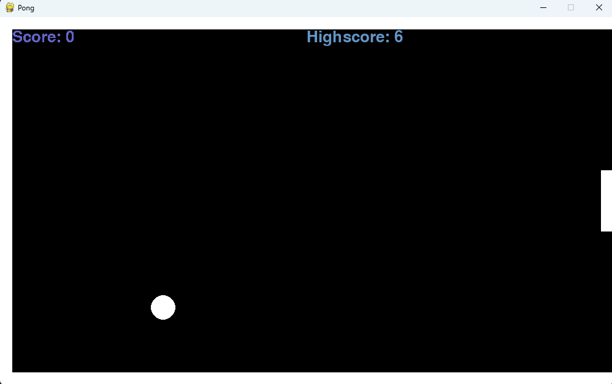

# 🏓 Pygame Pong

A simple single-player Pong game built using Python and Pygame.

The ball bounces off the walls and paddle, and the score increases with every successful paddle hit.  
The game ends when the ball misses the paddle.  
The highest score is saved locally in a text file.

---

## 🎮 Gameplay

- Single-player
- Ball collision with walls and paddle
- Score increases per paddle hit
- Game over when the ball misses
- Persistent high score stored in `highscore.txt`

---

## 📸 Screenshot

---

## 🚀 Installation

1. Clone the repository:

   git clone https://github.com/abdurraheem63/pygame-pong.git

2. Navigate into the project directory:

   cd pygame-pong

3. Install dependencies:

   pip install -r requirements.txt

4. Run the game:

   python pong.py

---

## 🛠 Built With

- Python
- Pygame

---

## 📄 License

This project is licensed under the MIT License.
